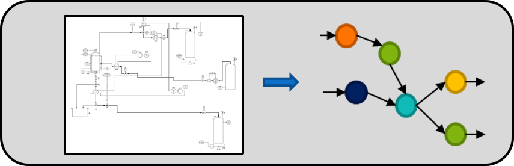

# DEXPI2graphML-Converter

## Publication using the DEXPI2graphML converter: https://doi.org/10.1016/j.dche.2022.100038
Jonas Oeing, Wolfgang Welscher, Niclas Krink, Lars Jansen, Fabian Henke, Norbert Kockmann,
Using artificial intelligence to support the drawing of piping and instrumentation diagrams using DEXPI standard,
Digital Chemical Engineering, Volume 4, 2022, ISSN 2772-5081,

### Authors:
Jonas Oeing, Tim Holtermann 
TU Dortmund University,
Laboratory of Equipment Design

### Tool to convert DEXPI-P&ID-Flowsheets into GraphML-graphs, which can be processed in ML/DL-applications via python (e.g. pytorch, keras etc.)
- DEXPI (specification [1]) provides machine-readable plant topology data
- Availability for application in artificial intelligence
- Conversion via a graphical user interface

<figure role="group">
  
    <figcaption>
    Figure 1. Idea of converting a DEXPI Piping- and Instrumentation Diagram (P&ID) into a graphML graph representation.
  </figcaption>
</figure>

## Note:
The skript was tested with P&ID-flowsheets (DEXPI-xml) created with the software <b>PlantEngineer</b> developed by <b>X-Visual Technologies</b>. 
 It is important, that the connection of all MS Visio shapes are correctly connected by the user. Otherwise the tool will not achieve the 
desired output because of mission topology information of the DEXPI files.

## Install:
The converter is available as an application for Python.
A application for Windows 10 will be available soon.

### Python installation
1. Install Python (anaconda) from https://www.anaconda.com/products/individual
2. Load the following python libraries
	- [NetworkX](https://networkx.org/) (vers. 2.4) [2]
	- [Matplotlib](https://matplotlib.org/) (vers. 3.2.2) [3]
	- [Pandas](https://pandas.pydata.org/) (vers. 1.0.5) [4]
	- [NLTK](https://www.nltk.org/) (vers. 3.5) [5]
	- [Pillow](https://pillow.readthedocs.io/en/stable/) (vers. 7.2.0) [6]
	- [PySimpleGUI](https://pysimplegui.readthedocs.io/en/latest/) (vers. 4.56.0) [7]
	- [lxml](https://lxml.de/) (vers. 4.5.2) [8]
    - [openpyxl]() (vers. 3.0.9) [9]
3. Download the folder dexpi2graph_python.
4. Running the script *dexpi2graphML.py* starts the converter.

## How to Use:
The *DEXPI2graphML  converter* consists a graphical user interface (GUI) shown in Figure 2.
On the upper left side you find a bar to browse the input folder, which containts the DEXPI-P&IDs you want to convert.
On the left handside a console shows the output as well as the error log of the conversion process.
On the left handside you will find a plot window which shows the converted plots.

<figure role="group">
  
  <figcaption>
    Figure 2. GUI of the DEXPI2graphML converter.
  </figcaption>  
</figure>

## Example P&ID files:
The folder *DEXPI_examples* containts two different DEXPI P&IDs:
- A laboratory distillation plant [P&ID_distillation_laboratory](./DEXPI_examples/distillation_laboratory.xml) [10]
- Textbooks example distillation plant [P&ID_distillation](./DEXPI_examples/distillation_plant.xml) [11]

## References:
[1] DEXPI Initiative, DEXPI specification 1.3, https://dexpi.org/specifications/, accessed on 25.08.2021 
[2] NetworkX developers, online documentation, https://networkx.org/, accessed on 09.03.2022 
[3] Matplotlib development team, online documentation, https://matplotlib.org/, accessed on 09.03.2022 
[4] Pandas development team, online documentation, https://pandas.pydata.org/, accessed on 09.03.2022 
[5] NLTK project, online documentation, https://www.nltk.org/, accessed on 09.03.2022 
[6] Alex Clark and contributors, online documentation, https://pillow.readthedocs.io/en/stable/, accessed on 09.03.2022 
[7] PySimpleGUI, online documentation, https://pysimplegui.readthedocs.io/en/latest/, accessed on 09.03.2022 
[8] lxml development team, online documentation, https://lxml.de/, accessed on 09.03.2022 
[9] openpyxl, online documentation, https://openpyxl.readthedocs.io, accessed on 23.02.2023 
[10] Oeing, J., Neuendorf, L.M., Bittorf, L., Krieger, W. and Kockmann, N. (2021), Flooding Prevention in Distillation and Extraction Columns with Aid of Machine Learning Approaches. Chem. Ing. Tech., 93: 1917-1929. https://doi.org/10.1002/cite.202100051 
[11] Baerns, M., Behr, A., Brehm, A., Gmehling, J., Hinrichsen, K.-O., Hofmann, H., & Onken, U., Palkovits, R., Renken, A. (2013). Technische Chemie. Wiley-VCH, Weinheim. 
